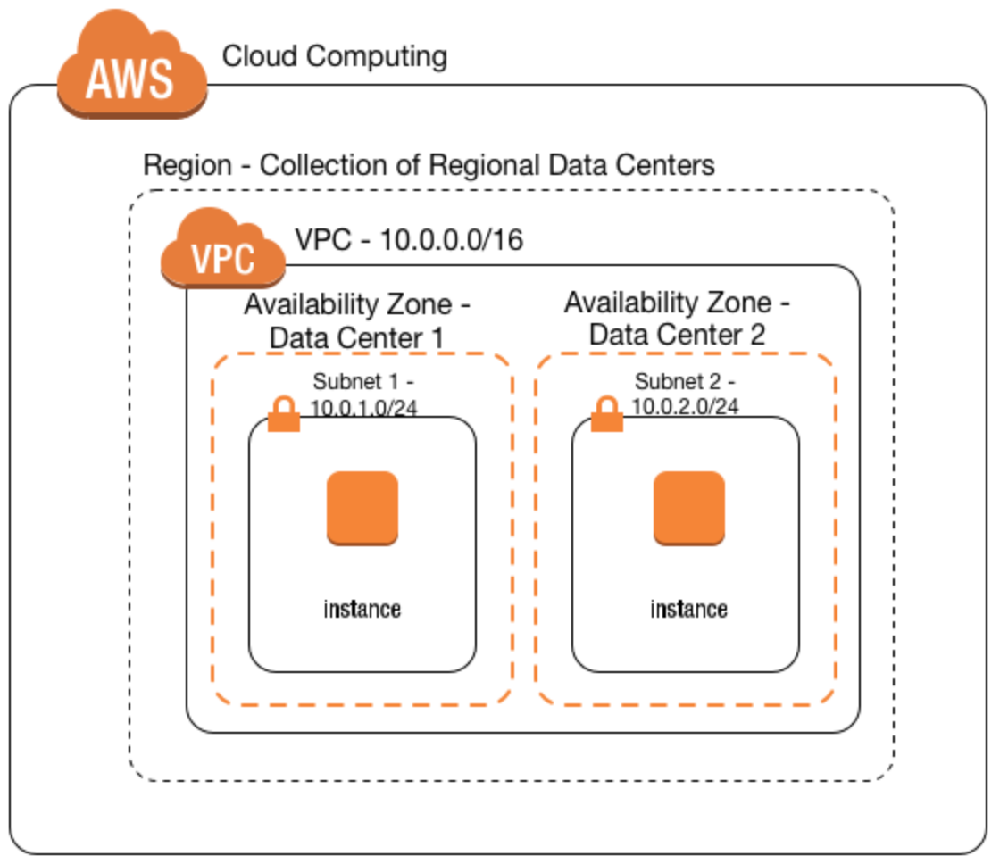

# Automated Machine Learning

The goal of this repository is to introduce to Machine Learning Engineers the goodies of
Infrastructure as Code. To accomplish that, we show here how to use Hashicorp Terraform
to create the following artefacts:

1. Virtual Private Cloud (a.k.a. VPC);
2. Internet Gateway;
3. Security Group;
4. Subnet;
5. Virtual Machine;
6. Volume; and
7. S3 Bucket.

If you are neither familiar with Cloud Computing nor with AWS jargon, please have a look
at the image depicted below for a better understanding:



In the image above the Internet Gateway is missing. As the name suggests, it is a
gateway between the VPC and the AWS Region boundaries that allows traffic to the outside world.

Another detail exhibited in the image is the two availability zones that are used by
two subnets. Although we can have more than one subnet per VPC per availability zone,
In our case we will have only one subnet.

# Dependencies

First of all, make sure you have Hashcorp Terraform installed on your MacBook / Laptop.
You can find out how to get it here -> https://www.terraform.io/

In order to continue, you will need the following:

1. AWS account (no surprise here);
2. A user under the Identity and Access Management [IAM](https://console.aws.amazon.com/iam/);
3. Security credentials for that user:
   * Also created under the [IAM](https://console.aws.amazon.com/iam/).
   * This will give you a ```key``` and ```secret``` to be used for authentication purposes.
4. Permissions:
   * AmazonEC2FullAccess
   * AmazonS3FullAccess

Remark: if you feel like automating the part above, please go ahead and contribute
to this repository. :)

On the AWS [EC2 Console](https://eu-west-1.console.aws.amazon.com/ec2/), you need
to create a key/pair that will be used during the configuration of the instance:
some files and credentials need to be copied to the virtual machine during creation:

* IAM credentials: used by the Docker container to talk to S3.
* Hyper-parameters: the ```hyperparams.json``` is used by the python application,
  inside the Docker container, to tune the Neural Network model.

# Files to Look At

Your IAM credentials should be configured in the following files:

* variables.tf: used by Terraform to be able to talk to AWS.
  * Do not forget to change the ```allowed_cidrs``` to allow ssh connection from your IP address.
* credentials: used by AWS CLI tool to upload the weights / results to S3.

Remark: do not make your credentials available on Github!

# Creating the Infrastructure

After cloning this repository and adding your credentials to the files as explained above,
it's time to make things happen! For one time only, you will need to init your Terraform
environment. To do that, simply execute:

* ```terraform init```

This will initialise your environment and install the provider we are using: aws.

Now let's create our infrastructure:

* ```terraform apply```

The command above will apply the plan we have created onto AWS. You will see that nine
resources will be created. Just type ```yes``` to continue and wait until it's all done.

It will take about 6 minutes to finish. You may ask: why so long? Have a look at the ```scripts/prepare_instance.sh```
to have an idea.

We are upgrading Ubuntu, installing Docker CE, NVIDIA-Docker, and the NVIDIA CUDA Drivers.
This is all needed to get our Neural Networks using all the resources that the ```g2.2xlarge```
instance type has to offer. If you want it to be faster, you can create an AMI out of your instance
and just keep the last two lines of the ```scripts/prepare_instance.sh``` file. It will only
fetch the Docker image, in case there are changes. The whole creation process should go from 6 to 2 minutes.

Once the installation is done, it will fetch the ```ekholabs/toxicity``` image from [Hub Docker](https://hub.docker.com/r/ekholabs/toxicity/)
and start the Python application.

To know more about what's going on on the Docker container, have a look at the [Kaggle Toxicity](https://github.com/ekholabs/kaggle_toxicity) repository.

Once everything is ready, you should see the public IP that has been associated with your instance on the console.
You can now use you key to ssh into the machine.

I'm assuming you are familiar with remote connections, Docker, and a couple of other things.

If you have successfully connected to your infrastructure, try to check what is happening. The commands
below will give you insight on how the GPU is being used and what the Docker container is doing:

* ```nvidia-smi```
* ```sudo docker ps```
  * Copy the Container ID
* ``` sudo docker logs -f [CONTAIDER_ID]```
  * Tail the logs to follow up on the execution of the model

With the default setting in the ```hyperparams.json``` file, the model will run for 6 epochs or
stop if the loss goes up for 3 epochs in a row. After the execution is done, the best weights are copied
to [S3](https://s3.console.aws.amazon.com/s3). You should download the weights from S3 before
destroying you infrastructure.

To destroy everything, simply do:

* ```terraform destroy```

Remark: do not let the machine alive on AWS. The GPU instance is expansive and you
might get a surprise by the end of the month.

# WIP

This is still working in progress. I'm going to continue the work on it and try to add some other features.
For instance, I want to save the model as well. It makes life easy to load the model and then the weights
on top of it, just in case you want to predict some new values on an already trained model.

In addition to that, I also want to make it more generic and offer more sample file with preset hyper-parameters.

Keep an eye on it.
